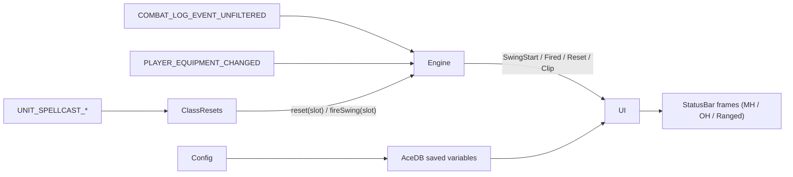

# Weapon Swing Timer Addon (Classic Era) — Design Spec

Date: 2026-04-24
Target: World of Warcraft Classic Era (`_classic_era_`, Interface `11507`-range)
Goal: Learn WoW addon development end-to-end by building a swing-timer addon from scratch, using the Ace3 ecosystem only as scaffolding and not to hide the interesting detection work.

A learning-oriented addon that tracks the player's main-hand, off-hand, and ranged swing timers with class-aware reset detection and a clipping-prediction warning.

## 1. Architecture — Engine + UI split

Six small Lua files, each with one responsibility:

- `Core.lua` — AceAddon root (`OnInitialize`, `OnEnable`), wires modules together.
- `Engine.lua` — pure state machine; subscribes to combat-log, spell-cast, and equipment events; emits `SwingStart`, `SwingFired`, `SwingReset`, `SwingParryHasted`, `ClipPredicted`, `ClipCleared`.
- `ClassResets.lua` — per-class registry table mapping spell IDs to engine calls (Warrior Slam reset, Hunter Auto Shot cast-interrupt, caster wand Shoot channel, Heroic Strike / Cleave on-next-swing).
- `UI.lua` — `StatusBar` frames (MH / OH / ranged), draggable anchor, `OnUpdate` handler, spark, weapon icon, clip overlay.
- `Config.lua` — AceConfig options tree, registers slash commands (`/wst`, `/wstc`).
- `Defaults.lua` — default saved-variable schema.

Dependency direction: ClassResets → Engine → UI (via callbacks). Engine never imports UI or ClassResets.



## 2. Project structure

```
weapon-timer-addon-classic/            (repo root)
├── .pkgmeta                           (BigWigs Packager manifest)
├── .luacheckrc                        (luacheck config)
├── .github/
│   └── workflows/
│       └── release.yml                (tagged-release packaging)
├── README.md
├── LICENSE
├── docs/
│   └── superpowers/
│       └── specs/
│           └── 2026-04-24-weapon-swing-timer-classic-design.md
└── WeaponSwingTimerClassic/           (the addon folder — packaged as the zip)
    ├── WeaponSwingTimerClassic.toc
    ├── embeds.xml
    ├── Libs/                          (packager-managed, gitignored)
    ├── Defaults.lua
    ├── Engine.lua
    ├── ClassResets.lua
    ├── UI.lua
    ├── Config.lua
    └── Core.lua
```

**`WeaponSwingTimerClassic.toc`**:

```
## Interface: 11507
## Title: Weapon Swing Timer (Classic)
## Notes: Tracks MH/OH/ranged swings with class-aware reset detection.
## Author: <you>
## Version: 0.1.0
## SavedVariables: WeaponSwingTimerClassicDB

embeds.xml
Defaults.lua
Engine.lua
ClassResets.lua
UI.lua
Config.lua
Core.lua
```

**`.pkgmeta`** declares Ace3 + LibSharedMedia externals so `Libs/` is built, not committed:

```yaml
package-as: WeaponSwingTimerClassic
externals:
    WeaponSwingTimerClassic/Libs/LibStub: https://repos.wowace.com/wow/libstub/trunk
    WeaponSwingTimerClassic/Libs/CallbackHandler-1.0: https://repos.wowace.com/wow/callbackhandler/trunk/CallbackHandler-1.0
    WeaponSwingTimerClassic/Libs/AceAddon-3.0: https://repos.wowace.com/wow/ace3/trunk/AceAddon-3.0
    WeaponSwingTimerClassic/Libs/AceEvent-3.0: https://repos.wowace.com/wow/ace3/trunk/AceEvent-3.0
    WeaponSwingTimerClassic/Libs/AceConsole-3.0: https://repos.wowace.com/wow/ace3/trunk/AceConsole-3.0
    WeaponSwingTimerClassic/Libs/AceDB-3.0: https://repos.wowace.com/wow/ace3/trunk/AceDB-3.0
    WeaponSwingTimerClassic/Libs/AceDBOptions-3.0: https://repos.wowace.com/wow/ace3/trunk/AceDBOptions-3.0
    WeaponSwingTimerClassic/Libs/AceGUI-3.0: https://repos.wowace.com/wow/ace3/trunk/AceGUI-3.0
    WeaponSwingTimerClassic/Libs/AceConfig-3.0: https://repos.wowace.com/wow/ace3/trunk/AceConfig-3.0
    WeaponSwingTimerClassic/Libs/LibSharedMedia-3.0: https://repos.wowace.com/wow/libsharedmedia-3-0/trunk
ignore:
    - .github
    - README.md
    - LICENSE
    - docs
    - .luacheckrc
```

## 3. Engine — swing state machine

**Per-slot state**:

```lua
Engine.state = {
    mainHand = { speed = 0, startedAt = 0, firesAt = 0, active = false },
    offHand  = { speed = 0, startedAt = 0, firesAt = 0, active = false },
    ranged   = { speed = 0, startedAt = 0, firesAt = 0, active = false,
                 aiming = false, aimEndsAt = 0 },
}
```

**Inputs subscribed**:

- `COMBAT_LOG_EVENT_UNFILTERED` — filtered on playerGUID for `SWING_DAMAGE` / `SWING_MISSED` / `RANGE_DAMAGE` / `RANGE_MISSED`; dest-filtered for `SWING_MISSED` with `missType == "PARRY"`.
- `UNIT_ATTACK_SPEED`, `UNIT_RANGEDDAMAGE` — re-read speeds on haste change.
- `PLAYER_EQUIPMENT_CHANGED` — reset affected slot.
- `START_AUTOREPEAT_SPELL` / `STOP_AUTOREPEAT_SPELL` — ranged toggle.
- `UNIT_SPELLCAST_START` / `SUCCEEDED` / `INTERRUPTED` / `FAILED` — clip prediction and (via ClassResets) class-specific behavior.

**Outputs** (CallbackHandler-1.0 events): `SwingStart(slot, speed)`, `SwingFired(slot)`, `SwingReset(slot, reason)`, `SwingParryHasted(slot, newFiresAt)`, `ClipPredicted(slot, willClipBy)`, `ClipCleared(slot)`.

**Parry-haste rule** (Vanilla): when the player parries an incoming melee swing, the player's main-hand timer is shortened but cannot drop below 20% of the base swing duration remaining:

```
newFiresAt = max(firesAt - 0.4 * speed, startedAt + 0.2 * speed)
```

**Clipping prediction**: on `UNIT_SPELLCAST_START` for the player, compute cast end time; if it exceeds any slot's `firesAt`, emit `ClipPredicted(slot, delta)`. On `SUCCEEDED`, `INTERRUPTED`, or `FAILED`, emit `ClipCleared`. No per-frame polling needed.

## 4. ClassResets — class registry

Declarative table, spell-ID keyed (resolved to localized names at load via `GetSpellInfo`):

```lua
Registry = {
    WARRIOR = {
        onCastSucceeded   = { [1464] = function(e) e:Reset("mainHand", "slam") end },  -- Slam
        onNextSwingSpells = { [78] = "mainHand", [845] = "mainHand" },                 -- Heroic Strike, Cleave
    },
    HUNTER = {
        onCastStart       = { [19434] = rangedPause, [2643] = rangedPause },           -- Aimed Shot, Multi-Shot
        onCastSucceeded   = { [19434] = rangedResume, [2643] = rangedResume },
        onCastInterrupted = { [19434] = rangedResume, [2643] = rangedResume },
    },
    MAGE    = { onCastStart = { [5019] = rangedPause } },                              -- Shoot (wand)
    PRIEST  = { onCastStart = { [5019] = rangedPause } },
    WARLOCK = { onCastStart = { [5019] = rangedPause } },
    ROGUE   = {},
    DRUID   = {},
    PALADIN = {},
    SHAMAN  = {},
}
```

Handles the Heroic Strike / Cleave edge case: those abilities replace the next swing but are logged as `SPELL_DAMAGE` rather than `SWING_DAMAGE`. ClassResets listens for `SPELL_DAMAGE` on these spell IDs and calls `engine:FireSwing("mainHand")` so the engine's timer still restarts correctly.

## 5. UI — frames and OnUpdate

Structure: one draggable container (`WSTC_Anchor`) with three `StatusBar` children (MH / OH / ranged), each containing `.bg`, `.fill`, `.spark`, `.label`, `.time`, `.icon`, `.clip` textures / font strings.

**OnUpdate hot path** — three comparisons, three `SetValue` calls; registered only when any slot is `active`:

```lua
local function OnUpdate(self)
    local now = GetTime()
    for slot, bar in pairs(UI.bars) do
        local s = Engine.state[slot]
        if s.active then
            local remaining = max(0, s.firesAt - now)
            bar:SetValue(1 - remaining / s.speed)
            bar.time:SetFormattedText("%.2f", remaining)
            bar.spark:SetPoint("CENTER", bar, "LEFT", bar:GetValue() * bar:GetWidth(), 0)
        end
    end
end
```

**Dynamic layout** — `UI:Relayout()` runs on `PLAYER_EQUIPMENT_CHANGED` / `START_AUTOREPEAT_SPELL` / `STOP_AUTOREPEAT_SPELL`. Shows MH always, OH only when off-hand is equipped, ranged only when ranged is equipped (optionally always per `db.rangedAlwaysVisible`). Re-anchors so visible bars stack with no gaps.

**Weapon icon** — `GetInventoryItemTexture("player", slotID)` with slot 16/17/18; refreshed on equipment change.

**Clipping** — `ClipPredicted` shows `bar.clip` overlay (red tint) and triggers sound if enabled; `ClipCleared` hides it.

**Sound on swing** — `UI:OnSwingFired` plays LSM-resolved sound if `db.soundOnSwing`.

**Drag** — anchor `StartMoving` / `StopMovingOrSizing`, saves `point/relPoint/x/y` to profile.

## 6. Configuration

**Saved variables** (AceDB, per-character profiles, DB name `WeaponSwingTimerClassicDB`):

```lua
defaults = {
    profile = {
        locked = false,
        position = { point = "CENTER", relPoint = "CENTER", x = 0, y = -150 },
        width = 200, height = 16, spacing = 4, alpha = 1.0,
        texture = "Blizzard",
        font = "Friz Quadrata TT",
        fontSize = 11,
        showTimeText = true,
        showSpark = true,
        showIcon = true,
        iconPosition = "LEFT",
        iconSize = 16,
        rangedAlwaysVisible = false,
        clipWarning = true,
        soundOnSwing = false, soundOnSwingKey = "None",
        soundOnClip  = false, soundOnClipKey  = "None",
        colors = {
            mainHand = { r = 0.2, g = 0.6, b = 1.0 },
            offHand  = { r = 0.4, g = 0.4, b = 1.0 },
            ranged   = { r = 0.9, g = 0.6, b = 0.1 },
            clipping = { r = 1.0, g = 0.0, b = 0.0 },
        },
    },
}
```

**Options tree** (AceConfig) — groups: `General` (lock, clip toggle, ranged always visible), `Appearance` (width/height/spacing/alpha, texture/font pickers via LSM30 controls, show spark/icon/time, icon position), `Colors` (four color pickers), `Sounds` (two toggles + two LSM sound pickers), `Profiles` (AceDBOptions-generated).

**Slash commands** (AceConsole): `/wst` and `/wstc` open the options panel; `/wst lock` and `/wst unlock` are shortcuts for the drag-lock toggle.

## 7. Testing & developer workflow

**Loop**: symlink (junction on Windows) the addon folder into `_classic_era_/Interface/AddOns/`, edit in VS Code, `/reload` in-game.

```
mklink /J "...\_classic_era_\Interface\AddOns\WeaponSwingTimerClassic" "...\weapon-timer-addon-classic\WeaponSwingTimerClassic"
```

**Debugging tools**: `/etrace` (event trace), `/dump`, BugSack + BugGrabber for Lua errors.

**Manual test scenarios**:

- Two-hand MH only swinging.
- Dual-wield MH + OH ticking independently.
- Hunter Auto Shot on/off; cast Aimed Shot mid-shot.
- Parry haste versus mobs that parry (verify MH shortens).
- Warrior Slam mid-swing (verify reset).
- Heroic Strike / Cleave (verify swing still fires on schedule).
- Weapon swap mid-combat.
- Clipping warning on cast starts.
- Out-of-combat / mounted / in town — zero CPU, no errors.

**CI**: GitHub Actions runs `luacheck` on all `.lua` files with `.luacheckrc` that declares the WoW API surface we use as `read_globals` and `WeaponSwingTimerClassicDB` as a `globals`.

## 8. Distribution (v1 scope)

Personal use + GitHub Releases only. Tagged releases trigger BigWigs Packager via GitHub Actions to build a zip (pulls libs per `.pkgmeta`) and attach it to the release. No CurseForge / WoWInterface / Wago publishing yet.

```yaml
# .github/workflows/release.yml
name: Release
on:
    push:
        tags: ['v*']
jobs:
    package:
        runs-on: ubuntu-latest
        steps:
            - uses: actions/checkout@v4
              with: { fetch-depth: 0 }
            - uses: BigWigsMods/packager@v2
              with:
                  args: -g classic -d -z
              env:
                  GITHUB_TOKEN: ${{ secrets.GITHUB_TOKEN }}
```
